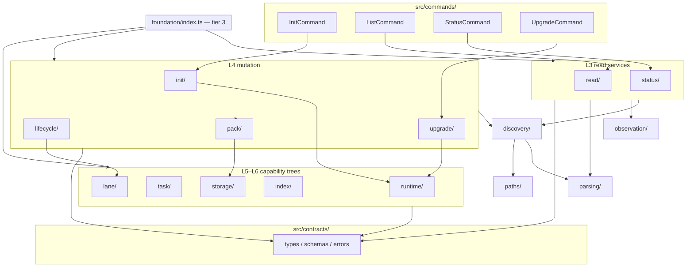

# Watchtower Foundation Module Architecture

Status: **Accepted — implementation architecture (capability-tree amendment 2026-08-04)**
Scope: `src/foundation/` target layout, barrels, dependency layers, and public surfaces
Applies to: v1 implementation and post-v1 foundation evolution
Last updated: 2026-08-04

**Amendment:** Flat L5 sibling capsules from the original REF-01 interim target are
**superseded** by nested capability trees per
[foundation-capability-tree-amendment.md](foundation-capability-tree-amendment.md).
REF-01 clearing the foundation root was necessary but not sufficient; REF-03
delivers the grouped layout.

This document is the **normative target architecture** for `src/foundation/`:
capability-owned domains, four-tier barrels, dependency layers, presentation
boundaries, and the public export contract commands and external packages may
depend on.

Execution — current-state diagnosis, file moves, phased migration, and
`REF-01`/`REF-02`/`REF-03` remediation batches — lives in
[foundation-layout-remediation.md](foundation-layout-remediation.md).

It supplements, but does not replace:

- [architecture.md](../architecture.md) — product separation of concerns;
- [nirvana-integration-architecture.md](../nirvana-integration-architecture.md) —
  NVB/runtime facade boundaries and the §2.1 module ownership sketch;
- [engineering-and-review-standard.md](../../development/engineering-and-review-standard.md) —
  layer ownership, size limits, barrel rules, naming; and
- [AGENTS.md](../../../AGENTS.md) — repository layout conventions.

Normative product behavior is unchanged. Conforming to this architecture is a
**structural requirement** for new foundation code. Remediation of the legacy
flat layout is tracked separately and must not change public CLI behavior,
schema version, or lane semantics unless a separate spec amendment says
otherwise.

---

## Table of contents

1. [Purpose and target outcome](#1-purpose-and-target-outcome)
2. [Design principles](#2-design-principles)
3. [Target topology](#3-target-topology)
4. [Capability domain catalog](#4-capability-domain-catalog)
5. [Three-tier barrel model](#5-three-tier-barrel-model)
6. [Dependency layers and allowed imports](#6-dependency-layers-and-allowed-imports)
7. [Public export contract](#7-public-export-contract)
8. [Presentation boundary](#8-presentation-boundary)
9. [Architecture test requirements](#9-architecture-test-requirements)
10. [Non-goals](#10-non-goals)
11. [Related documents](#11-related-documents)

---

## 1. Purpose and target outcome

`src/foundation/` is the application layer between `src/commands/` and
infrastructure ports (storage, NVB task runtime, leaf adapters). Every module
must belong to a **named capability domain** with a deliberate barrel surface.

### Target outcome

| Dimension | Legacy (pre-remediation) | Target |
|-----------|------------------------|--------|
| Root-level `.ts` files (excluding `index.ts`) | 93 | **0** |
| Foundation root barrel size | ~126 lines, ~80+ symbols | **≤50 lines**, domain re-exports only |
| Command deep-imports into foundation internals | 6+ paths | **0** (domain barrels only) |
| Shadow structures (`Foo.ts` beside `foo/`) | 8+ | **0** |
| Flat prefix clusters at foundation root (`runtimeCatalog/`, `taskRuntime/`, …) | 10+ | **0** (REF-03) |
| Architecture gates per major domain | 4 | **12+** |
| Wildcard re-exports at root | 4 (`export *`) | **0** |

New foundation work must land in the target shape even before remediation
completes. Do not add files to the foundation root except `index.ts`.

---

## 2. Design principles

### 2.1 Capability-first layout

Group code by **what it does for the product**, not by file type or
implementation-pack ID. When a capability needs **multiple modules or
sub-capsules**, they live under **one parent capability directory** with a parent
barrel (`runtime/`, `task/`, `lane/`, …). Do not scatter prefixed siblings at
foundation root (`runtimeCatalog/` next to `runtime/`).

Implementation packs (`wt-read-model`, `wt-lane-lifecycle`, etc.) are delivery
boundaries; foundation capability trees are runtime product boundaries. A domain
may span evidence from multiple packs (for example `status/` implements read-model
batch `RM-12` only).

See [foundation-capability-tree-amendment.md](foundation-capability-tree-amendment.md).

### 2.2 Inward dependencies

```text
commands/  →  foundation domain barrels  →  foundation capsules  →  contracts/
                                                              ↓
                                                    Nirvana / leaf ports
```

Commands never import capsule internals. Foundation domains never import
commands. Infrastructure capsules never import application services (`status/`,
`init/`). Sub-capsules import sibling sub-capsules only through the **parent
capability barrel** unless they are at the same tier and the dependency matrix
explicitly allows it.

### 2.3 Facade + capsule pattern

Every domain follows the **capability tree + capsule** pattern:

```text
<capability>/
  index.ts              ← tier-2 capability barrel (aggregates sub-capsules)
  <sub-capability>/
    index.ts            ← tier-1 capsule barrel (public surface of sub-area)
    DomainFacade.ts     ← primary service (optional)
    internalModule.ts
```

Example: `task/runtime/index.ts` (lane task runner port), not `taskRuntime/` at
foundation root. The positive template remains
`src/foundation/task/runtime/index.ts` after REF-03.

Rules:

1. **One primary responsibility** per module (engineering standard §5).
2. **Barrels export deliberately** — no wildcard growth at domain, capability, or root level.
3. **Document withheld exports** in barrel header comments (see `task/runtime/index.ts`).
4. **No shadow structures** — the facade lives inside the capsule directory.
5. **No flat prefix clusters** at foundation root — see
   [foundation-capability-tree-amendment.md](foundation-capability-tree-amendment.md).

### 2.4 Presentation stays at the edge

Foundation services return **typed results** and throw **typed errors**.
Human/JSON rendering lives in `foundation/presentation/` and command presenters.
This matches the engineering standard layer table and Nira's CLI mental model.

### 2.5 Architecture tests are mandatory

Each domain maintains an `*Architecture.spec.ts` that encodes:

- allowed import boundaries;
- barrel export allowlists/denylists;
- module size inventory for owned files; and
- forbidden patterns (SQL outside `storage/`, `child_process` outside approved
  adapters, etc.).

---

## 3. Target topology

### 3.1 Full target tree

```text
src/foundation/
  index.ts                         # tier-3 root barrel (domain re-exports only)

  # ── L1: pure / low I/O ─────────────────────────────────────────────
  paths/
    index.ts
    canonicalPaths.ts
    dataHomeResolver.ts
    DataRoot.ts
    workspaceResolver.ts

  parsing/
    index.ts
    envParser.ts
    stateParser.ts
    scalarLineParser.ts
    stateRecordParser.ts
    laneLifecycle.ts
    JsonlParser.ts

  presentation/
    index.ts
    commandEnvelopeSerializer.ts
    ResultRenderer.ts
    initPlanPresenter.ts
    upgradePlanPresenter.ts

  # ── L2: read-only I/O / observation ────────────────────────────────
  discovery/
    index.ts
    homeLaneDiscovery.ts
    laneDiscovery.ts
    LaneDiscoveryFileSystem.ts
    RelevantLaneDiscovery.ts
    LaneSelector.ts
    SecondaryDiscovery.ts
    membershipIndex.ts
    laneManifestReader.ts

  bindings/
    index.ts
    repositoryBindings.ts
    writableConflicts.ts

  observation/
    index.ts
    runtimeObservations.ts
    NirvanaTmuxObserver.ts
    heartbeatObservation.ts
    TmuxSessionProcessRunner.ts

  # ── L3: application read services ──────────────────────────────────
  read/
    index.ts
    LaneListService.ts
    LaneListCursor.ts
    ResolvedConfigService.ts
    LaneConfigProjectionReader.ts
    LaneInstallIdentityReader.ts
    LaneReadFileStore.ts
    LaneStateProjectionReader.ts

  status/
    index.ts
    StatusProjection.ts
    statusHealth.ts
    statusViewProjection.ts
    statusLaneTypes.ts
    statusPackTypes.ts
    statusPackRecordProjection.ts
    statusRegularFileIdentity.ts
    StatusAcceptedInputInspector.ts
    StatusConflictInspector.ts
    StatusEventProjection.ts
    StatusLaneInputReader.ts
    StatusLiveObserver.ts
    StatusPackAcceptanceAuthority.ts
    StatusPackContractReader.ts
    StatusPackFileInventory.ts
    StatusPackGitInspector.ts
    StatusPackGraphValidator.ts
    StatusPackIntegrity.ts
    StatusProofInputInspector.ts
    StatusRepositoryGitInspector.ts
    StatusRuntimeInventory.ts
    StatusSourceBaselineInspector.ts

  # ── L4: mutation / planners ────────────────────────────────────────
  init/
    index.ts
    InitPlanner.ts
    InitContracts.ts
    InitPorts.ts
    InitPreflightHost.ts
    InitRoutingValidator.ts
    initLocks.ts

  lifecycle/
    index.ts
    BindingMutator.ts
    MembershipRegistrar.ts
    # facades delegate to nested capsules:
    #   laneStore/, transactionalWriter/, coordinatorBaseline/

  pack/
    index.ts
    PackConsumer.ts
    PackAcceptance.ts
    PackDriftObserver.ts
    PackSeal.ts
    packConsumerPorts.ts
    packFilesystemHost.ts
    packGitHost.ts
    packSchemaValidatorsHost.ts
    packJsonReaders.ts
    packSchemaFormats.ts

  upgrade/
    index.ts
    UpgradePlanner.ts
    UpgradePreviewSource.ts
    upgradeFileSystem.ts
    MigrationRegistry.ts
    MigrationSteps.ts
    migrationValidation.ts

  # ── L5–L6 capability trees (REF-03 target) ─────────────────────────
  runtime/
    index.ts
    catalog/              # was runtimeCatalog/
    distribution/         # was managedAssets/; managed links + task profile
    knowledge/            # was runtimeKnowledgeManifest/
    leaf/                 # was runtime/ (L6 process invocation)

  task/
    index.ts
    runtime/              # was taskRuntime/
    catalog/              # was taskCatalogComposition/

  lane/
    index.ts
    store/                # was laneStore/
    writer/               # was transactionalWriter/
    coordinator/            # was coordinatorBaseline/

  pack/
    …                     # L4 consumer/seal/drift (unchanged modules)
    index/                # was packIndex/ (nested L5 compile pipeline)

  index/                  # coordinator sealed-pack index (CA-02)
    index.ts
    store/                # was indexStore/
    query/                # was indexQuery/

  storage/
  hostAdapters/
  distribution/           # L6 Nirvana install verify — NOT runtime/distribution
```

**Superseded (forbidden at foundation root after REF-03):** flat siblings
`runtimeCatalog/`, `runtimeDistribution/`, `managedAssets/`,
`runtimeKnowledgeManifest/`, `taskRuntime/`, `taskCatalogComposition/`,
`laneStore/`, `transactionalWriter/`, `coordinatorBaseline/`, `packIndex/`,
`indexStore/`, `indexQuery/`, and top-level `runtime/` (relocated to
`runtime/leaf/`).

Full move table:
[foundation-capability-tree-amendment.md §3](foundation-capability-tree-amendment.md#3-normative-target-tree-capability-grouped).

### 3.2 Structural diagram



### 3.3 Import direction (target)

```text
commands ──► domain/index.ts ──► capsule internals
                                  (never the reverse path for consumers)
```

All domains follow the capability-tree encapsulation model (§2.3).

---

## 4. Capability domain catalog

Each **top-level directory** is either a flat domain (L1–L4) or a **capability
tree** (L5–L6 grouped under `runtime/`, `task/`, `lane/`, `index/`). Sub-capsules
have tier-1 barrels; capability parents have tier-2 barrels. See
[foundation-capability-tree-amendment.md](foundation-capability-tree-amendment.md).

### 4.1 L1–L4 flat domains

| Domain directory | Layer | Purpose | Primary facade / entry | Pack evidence |
|------------------|------:|---------|------------------------|---------------|
| `paths/` | L1 | Canonical path rules, data-home resolution, workspace context | `resolveWorkspace`, `resolveWatchtowerDataHome` | RM-03 |
| `parsing/` | L1 | Strict env/state/scalar/JSONL parsing | `parseEnvConfig`, `parseLaneState`, `parseJsonlStream` | RM-04, RM-05 |
| `presentation/` | L1 | Command envelope serialization and terminal/JSON rendering | `buildCommandResult`, `renderResult` | RM-02 |
| `schemaComposition/` | L1 | Deterministic JSON Schema composition | (module exports) | RM-13 |
| `discovery/` | L2 | Home and secondary lane discovery, selection | `discoverHomeLanes`, `selectLane` | RM-06, RM-07 |
| `bindings/` | L2 | Repository bindings and writable conflict inspection | `readRepositoryBindings`, `inspectWritableConflicts` | RM-08 |
| `observation/` | L2 | Tmux, heartbeat, runtime session observation | `observeRuntimeSessions`, `NirvanaTmuxObserver` | RM-09 |
| `read/` | L3 | `list` and `config show` services | `LaneListService`, `ResolvedConfigService` | RM-10 |
| `status/` | L3 | `status` projection and health derivation | `StatusProjection` | RM-12 |
| `init/` | L4 | Init argument resolution, preflight planning | `InitPlanner`, `validateInitRequest` | LC-01 |
| `lifecycle/` | L4 | Post-init binding/membership orchestration | `BindingMutator`, `MembershipRegistrar` | LC-04 |
| `pack/` | L4 | Pack acceptance, seal, drift, consumption hosts | `consumePack`, `observePackDrift` | LC-02, CA-01 |
| `upgrade/` | L4 | Upgrade preview/apply planning, migrations | `UpgradePlanner`, `MigrationRegistry` | UK-01–UK-03 |

### 4.2 L5–L6 capability trees (REF-03 target)

| Capability | Sub-capsule | Layer | Purpose | Primary facade | Pack evidence |
|------------|-------------|------:|---------|----------------|---------------|
| `runtime/` | `catalog/` | L5 | Immutable runtime version tree | `RuntimeCatalog` | RT-04 |
| | `distribution/` | L5 | Managed runtime links and task profile install | `ManagedAssets`, `LaneTaskProfileInstaller` | RT-06 |
| | `knowledge/` | L5 | Runtime/knowledge manifest validation | `RuntimeKnowledgeManifestValidator` | RT-02 |
| | `leaf/` | L6 | Leaf/process invocation adapters | `LeafRuntimeInvoker` | RT-05 |
| `task/` | `runtime/` | L5 | Lane task runner port and catalog | `LaneTaskRunner`, `NirvanaLaneTaskRunner` | RT-05 |
| | `catalog/` | L5 | Task catalog aggregate composition | (module exports) | RT-09 |
| `lane/` | `store/` | L5 | Transactional lane layout generation | `LaneStore` | LC-03 |
| | `writer/` | L5 | Atomic lane directory commit | `commitLane` | LC-03 |
| | `coordinator/` | L5 | Coordinator/session policy baselines at init | `buildCoordinatorBaseline` | LC-05 |
| `pack/index/` | — | L5 | Sealed-pack SQLite compile pipeline | `PackIndexCompiler` | CA-01 |
| `index/` | `store/` | L5 | Pack index store open/read | `IndexStore` | CA-02 |
| | `query/` | L5 | Bounded typed index queries | `IndexQuery` | CA-02 |
| `storage/` | — | L5 | Derived SQLite stores and migrations | `openDerivedStorage` | DB-01, CA-03 |
| `hostAdapters/` | — | L6 | Knowledge pack installers (Codex/Cursor/Claude) | `resolveHostAdapter` | UK-04 |
| `distribution/` | — | L6 | Nirvana closure/install verification | `NirvanaInstallVerifier` | RT-08 |

**Interim debt (forbidden after REF-03):** flat siblings `runtimeDistribution/`,
`runtimeCatalog/`, `managedAssets/`, `runtimeKnowledgeManifest/`, `taskRuntime/`,
`taskCatalogComposition/`, `laneStore/`, `transactionalWriter/`,
`coordinatorBaseline/`, `packIndex/`, `indexStore/`, `indexQuery/`, and
top-level `runtime/` (leaf capsule).

---

## 5. Four-tier barrel model

### 5.1 Tier definitions

| Tier | Location | Responsibility | Wildcards |
|------|----------|----------------|-----------|
| **T3 — Root** | `foundation/index.ts` | Stable import path for commands and external packages | ❌ Forbidden |
| **T2 — Capability** | `foundation/<capability>/index.ts` | Aggregate sub-capsules for one product capability (`runtime/`, `task/`, …) | ❌ Forbidden |
| **T1 — Capsule** | `foundation/<capability>/<sub>/index.ts` or flat `foundation/<domain>/index.ts` | Export the port, options types, and narrowly shared helpers | ❌ Forbidden |
| **T0 — Internal** | Module files not re-exported | Implementation detail | — |

Flat L1–L4 domains use T1 at their directory root. L5–L6 infrastructure uses
T2 + T1 under capability parents per
[foundation-capability-tree-amendment.md §4](foundation-capability-tree-amendment.md#4-barrel-model-extended-tiers).

### 5.2 Import rules by consumer

| Consumer | Allowed import paths | Forbidden |
|----------|---------------------|-----------|
| `src/commands/*` | `foundation/<domain>/index.js`, `foundation/<capability>/index.js`, `foundation/index.js` | Any path matching `foundation/**/<internal>.js` except through T1/T2/T3 barrel |
| `src/run.ts`, `src/cli.ts` | `foundation/presentation/index.js` | Domain internals |
| `spec/foundation/<domain>/*` | Domain under test + its declared dependencies | Unrelated domain internals (use public barrel instead) |
| `spec/integration/*` | `foundation/index.js` or specific domain barrels | Deep FS/SQL ports unless testing that capsule |
| Foundation domain A | Domain B's **barrel** or B's contracts types via `src/contracts/` | Domain B's internal files |
| Foundation domain A | Own capsule internals freely | — |

### 5.3 Template: tier-1 barrel header

Every capsule barrel must include a header modeled on `task/runtime/index.ts`:

```typescript
// Public surface of the <domain> capability.
// Deliberately NOT exported:
//   - <InternalHelper>
//   - <FsPort>
//   - <SqlSchemaConstant>
export {PrimaryFacade} from './PrimaryFacade.js';
export type {PrimaryFacadeOptions} from './PrimaryFacade.js';
```

### 5.4 Template: tier-3 root barrel

```typescript
// Foundation root — domain barrels only. Do not export capsule internals here.
export {
  LaneListService,
  ResolvedConfigService,
  type LaneListQuery,
  type ResolvedConfigQuery
} from './read/index.js';

export {
  StatusProjection,
  type StatusProjectionOptions,
  type StatusProjectionQuery
} from './status/index.js';

export {
  InitPlanner,
  validateInitRequest,
  type InitPlan,
  type InitRequest
} from './init/index.js';

export {
  buildCommandError,
  buildCommandResult,
  renderError,
  renderResult
} from './presentation/index.js';

// … explicit named re-exports only; no `export *`
```

---

## 6. Dependency layers and allowed imports

### 6.1 Layer matrix

| Layer | Domains / capsules | May import from |
|------:|--------------------|-----------------|
| **L0** | `src/contracts/` | Other contracts, schema refs only |
| **L1** | `paths/`, `parsing/`, `presentation/`, `schemaComposition/` | L0 |
| **L2** | `discovery/`, `bindings/`, `observation/` | L0, L1 |
| **L3** | `read/`, `status/` | L0, L1, L2 |
| **L4** | `init/`, `lifecycle/`, `pack/`, `upgrade/` | L0–L3; L5 via **capability barrels** only (`runtime/index.js`, `lane/index.js`, …) |
| **L5** | `runtime/catalog/`, `runtime/distribution/`, `runtime/knowledge/`, `task/runtime/`, `task/catalog/`, `lane/store/`, `lane/writer/`, `lane/coordinator/`, `pack/index/`, `index/store/`, `index/query/`, `storage/` | L0, L1 (paths/parsing only) |
| **L6** | `runtime/leaf/`, `hostAdapters/`, `distribution/` | L0, L1, L5 ports as needed |

**Hard rules:**

1. L1 must not import L2+.
2. L3 must not import L4+.
3. L5 `storage/` is the **only** layer that imports the SQLite driver.
4. L6 `runtime/leaf/` owns process invocation; L4 never imports `node:child_process`.
5. L4 imports infrastructure through **T2 capability barrels**, not sub-capsule internals.
6. No circular dependencies — break cycles by moving shared types to `contracts/`.

Enforcement lives in `spec/foundation/foundationDependencyArchitecture.spec.ts`
(see [remediation plan](foundation-layout-remediation.md)).

---

## 7. Public export contract

### 7.1 Root barrel — permitted exports

| Symbol | Domain barrel | Used by |
|--------|---------------|---------|
| `LaneListService`, `LaneListQuery`, pagination helpers | `read/` | `ListCommand` |
| `ResolvedConfigService`, `ResolvedConfigQuery` | `read/` | `ConfigCommand` |
| `StatusProjection`, `StatusProjectionQuery` | `status/` | `StatusCommand` |
| `InitPlanner`, `validateInitRequest`, `InitPlan`, `InitRequest` | `init/` | `InitCommand` |
| `UpgradePlanner`, `UpgradePreviewSource` | `upgrade/` | `UpgradeCommand` |
| `buildCommandResult`, `buildCommandError`, `renderResult`, `renderError` | `presentation/` | All commands, `run.ts` |
| `resolveHostAdapter`, `create*HostAdapter`, `INSTALL_SCOPES`, `HOST_NAMES` | `hostAdapters/` | `SkillInstallCommand` |
| `LaneTaskRunner`, `NirvanaLaneTaskRunner`, `LaneTaskCatalog` | `task/` (via `task/runtime/`) | Watch/coordinator batches |
| `RuntimeCatalog`, `ManagedAssets` | `runtime/` (via `runtime/catalog/`, `runtime/distribution/`) | Init, upgrade, doctor batches |

### 7.2 Root barrel — forbidden exports (capsule-internal)

| Symbol | Owner capsule | Why internal |
|--------|---------------|--------------|
| `PACK_INDEX_SCHEMA`, `PACK_INDEX_META_TABLE` | `pack/index/` | SQL DDL |
| `nodeManagedLinkFileSystem`, `ManagedLinkFileSystem` | `runtime/distribution/` | FS port |
| `parseInstallManifest` | `runtime/distribution/` | Parser |
| `COMPATIBILITY_NAMES`, `resolveCompatibilityName*` | `runtime/distribution/` | RT-06 internal |
| `gitUnavailable`, `nodePackGitInspector` | `pack/` | Host adapter |
| `createNodePackFileSystem`, `nodePackFileSystem` | `pack/` | Host adapter |
| `loadPackSchemaValidators` | `pack/` | Host adapter |
| `consumePack`, `observePackDrift`, pack seal helpers | `pack/` | Lifecycle/coordinator facades only |
| `IndexStore`, `IndexQuery` | `index/store/`, `index/query/` | CA batches use capability barrel |
| Wildcard re-exports from infrastructure capsules | respective capsules | Import capsule directly when needed |

### 7.3 Domain barrel surfaces (tier-2 examples)

#### `read/index.ts`

```typescript
export {LaneListService} from './LaneListService.js';
export type {LaneListQuery, LaneListServiceOptions} from './LaneListService.js';
export {ResolvedConfigService} from './ResolvedConfigService.js';
export type {ResolvedConfigQuery, ResolvedConfigServiceOptions} from './ResolvedConfigService.js';
export {digestLaneListQuery, paginateLaneList, validateLaneListPageInput, MAX_LIST_PAGE_SIZE} from './LaneListCursor.js';
// Internal readers — NOT exported
```

#### `status/index.ts`

```typescript
export {StatusProjection} from './StatusProjection.js';
export type {StatusProjectionOptions, StatusProjectionQuery} from './StatusProjection.js';
export {deriveStatusHealth} from './statusHealth.js';
export type {StatusHealthInput} from './statusHealth.js';
// All Status*Inspector modules — NOT exported
```

#### `init/index.ts`

```typescript
export {InitPlanner, validateInitRequest} from './InitPlanner.js';
export type {InitPlan, InitRequest, CoordinatorRoutingPolicy} from './InitContracts.js';
export type {InitPreflightPort, ScopeReadResult} from './InitPorts.js';
// initLocks, InitPreflightHost — NOT exported
```

#### `upgrade/index.ts`

```typescript
export {UpgradePlanner} from './UpgradePlanner.js';
export type {UpgradePlannerOptions} from './UpgradePlanner.js';
export {UpgradePreviewSource} from './UpgradePreviewSource.js';
export type {UpgradePreviewSourceOptions, UpgradeSourceQuery} from './UpgradePreviewSource.js';
export {MigrationRegistry} from './MigrationRegistry.js';
export type {MigrationRegistryOptions} from './MigrationRegistry.js';
export {stageMigrationPlan} from './MigrationSteps.js';
// upgradeFileSystem port — NOT exported
```

---

## 8. Presentation boundary

### 8.1 Ownership split

| Concern | Owner | Must not own |
|---------|-------|--------------|
| Typed query/result construction | Domain service (`read/`, `status/`, `init/`) | Terminal formatting |
| Envelope wrapping + schema validation | `presentation/commandEnvelopeSerializer.ts` | Discovery or mutation |
| Human/JSON rendering | `presentation/ResultRenderer.ts` | Business rules |
| Command-specific field layout | `src/commands/*Presenter.ts` | Domain algorithms |

### 8.2 Target command import pattern

```typescript
// InitCommand.ts
import {InitPlanner} from '../foundation/init/index.js';
import {presentInitPlan} from '../foundation/presentation/index.js';

// StatusCommand.ts
import {StatusProjection} from '../foundation/status/index.js';
import {buildCommandResult, renderResult} from '../foundation/presentation/index.js';
```

### 8.3 Command → domain import map

| Command | Domain imports |
|---------|----------------|
| `ListCommand` | `read/`, `presentation/` |
| `ConfigCommand` | `read/`, `presentation/` |
| `StatusCommand` | `status/`, `presentation/` |
| `InitCommand` | `init/`, `presentation/` |
| `UpgradeCommand` | `upgrade/`, `presentation/` |
| `SkillInstallCommand` | `hostAdapters/`, `presentation/` |
| `run.ts` | `presentation/` |

Command-specific presenters remain in `src/commands/`.

---

## 9. Architecture test requirements

### 9.1 Existing gates (update paths on move)

| Spec file | Domain |
|-----------|--------|
| `taskRuntimeArchitecture.spec.ts` | `task/runtime/`, `runtime/leaf/` |
| `managedAssetsArchitecture.spec.ts` | `runtime/distribution/` |
| `indexQueryArchitecture.spec.ts` | `index/query/`, `index/store/`, `storage/` |
| `runtimeKnowledgeManifestArchitecture.spec.ts` | `runtime/knowledge/` |
| `coordinatorBaselinePolicy.spec.ts` | `lane/coordinator/` |
| `foundationCapabilityTreeArchitecture.spec.ts` | Top-level dirs; forbidden flat prefix clusters (REF-03) |
| `runtimeCapabilityArchitecture.spec.ts` | `runtime/` subtree (REF-03) |
| `taskCapabilityArchitecture.spec.ts` | `task/` subtree (REF-03) |
| `laneCapabilityArchitecture.spec.ts` | `lane/` subtree (REF-03) |
| `indexCapabilityArchitecture.spec.ts` | `index/`, `pack/index/` (REF-03) |

### 9.2 Required gates (added during remediation)

| Spec file | Encodes |
|-----------|---------|
| `foundationDependencyArchitecture.spec.ts` | Layer import matrix (§6) |
| `foundationRootBarrelArchitecture.spec.ts` | Root export allowlist; forbidden internals |
| `commandImportArchitecture.spec.ts` | Commands import only domain/root barrels |
| `statusArchitecture.spec.ts` | Module inventory, size limits, import boundary |
| `initArchitecture.spec.ts` | Same |
| `discoveryArchitecture.spec.ts` | Same |
| `packArchitecture.spec.ts` | Same |
| `upgradeArchitecture.spec.ts` | Same |

### 9.3 Gate template (per domain)

Each `*Architecture.spec.ts` must include:

1. **Module inventory** — walk `src/foundation/<domain>/` recursively.
2. **Size inventory** — owned modules ≤200 lines (foundation service limit).
3. **Import boundary** — forbidden import patterns for that layer.
4. **Barrel export denylist** — symbols that must not appear in `foundation/index.js` or `src/index.js`.
5. **Positive control** — at least one regex self-test.

### 9.4 Positive template in codebase

```text
src/foundation/task/runtime/index.ts
spec/foundation/taskRuntimeArchitecture.spec.ts
```

---

## 10. Non-goals

| Item | Reason |
|------|--------|
| Flat prefix clusters at foundation root | REF-01 interim; remediated in REF-03 |
| Renaming domains to match pack IDs | Capability names are clearer at runtime |
| Renaming `foundation/distribution/` | Separate amendment if needed after REF-03 |
| Refactoring `src/contracts/` | Separate concern |
| Reorganizing `runtime-nvb/` handlers | Different layer; already capability-split |
| Changing public CLI commands, flags, or JSON shapes | Structural refactor only |
| Merging command presenters into foundation | Command-specific layout stays in commands |

---

## 11. Related documents

| Document | Role |
|----------|------|
| [foundation-capability-tree-amendment.md](foundation-capability-tree-amendment.md) | REF-03 capability tree — supersedes flat L5 layout |
| [foundation-layout-remediation.md](foundation-layout-remediation.md) | File migration inventory, reviewer checklist |
| [foundation-refactor-implementation-map.md](foundation-refactor-implementation-map.md) | Milestones, work units, dependencies, waves |
| [foundation-refactor-implementation-tracker.md](foundation-refactor-implementation-tracker.md) | **Live status** |
| [architecture.md](../architecture.md) | Product separations |
| [nirvana-integration-architecture.md](../nirvana-integration-architecture.md) | NVB/runtime facade targets |
| [engineering-and-review-standard.md](../../development/engineering-and-review-standard.md) | Mandatory gates |
| [AGENTS.md](../../../AGENTS.md) | Repository conventions |

### Pack traceability

| Foundation domain | Primary accepted batch evidence |
|-------------------|--------------------------------|
| `paths/`, `parsing/` | RM-03, RM-04, RM-05 |
| `discovery/`, `bindings/` | RM-06, RM-07, RM-08 |
| `read/` | RM-10 |
| `status/` | RM-12 |
| `task/runtime/`, `runtime/leaf/` | RT-05 |
| `runtime/distribution/`, `runtime/catalog/` | RT-04, RT-06 |
| `pack/`, `pack/index/`, `index/store/`, `index/query/` | LC-02, CA-01, CA-02 |
| `init/`, `lane/store/`, `lane/writer/` | LC-01, LC-03 |
| `lane/coordinator/` | LC-05 |
| `upgrade/` | UK-01, UK-02 |
| `hostAdapters/` | UK-04 |
| `distribution/` | RT-08 |
| `schemaComposition/` | RM-13 |
| `taskCatalogComposition/` | RT-09 |

---

*End of document.*
