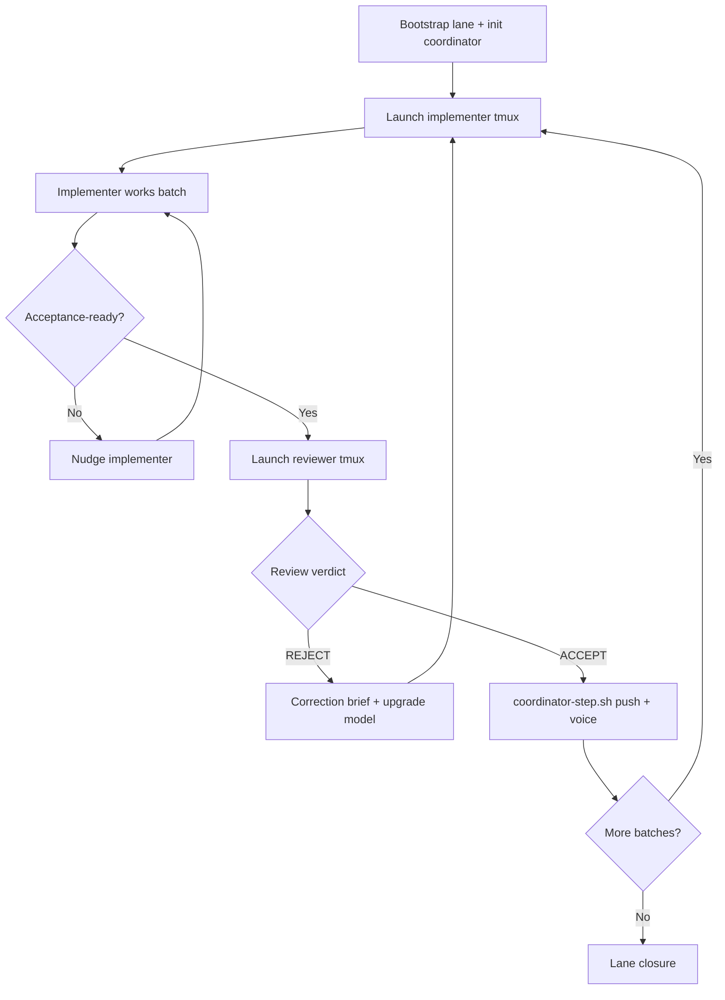

# Implementation Lane Coordinator — Playbook

This document is the **normative coordinator flow** extracted from the AwrUX
HtmlTreeUpdater remediation lane. Adapt names/paths via `lane.config.env`.

## Roles

| Role | Owner | Does |
|------|-------|------|
| **Coordinator** | Cursor session on primary account | Wake, nudge, dispatch review, push, advance lane |
| **Implementer** | tmux + Codex/Claude per batch | Execute work-batch brief; no acceptance commit |
| **Reviewer** | tmux + Codex on secondary account | Review-batch brief; ACCEPT/REJECT; acceptance commit |
| **Operator** | Human | Pause (`/stop`), queue messages, override model/account |

## Directory layout (in target repo)

```text
docs/spec/<domain>/<lane>/implementation/     # impl pack (committed)
  work-batches/
  review-batches/
  implementation-tracker.md
  implementation-roadmap.md

.local/agent-reports/<lane-slug>/coordinator/  # runtime (never commit)
  lane.config.env
  coordinator-lane-state.txt
  coordinator-watch.sh
  coordinator-step.sh
  coordinator-agent-brief.md
  ...
```

## Lifecycle



## Coordinator wake checklist

On every `AGENT_LOOP_WAKE_lane`:

1. Read `coordinator-lane-state.txt` — current batch, tmux names, parallel lanes
2. Read tracker + roadmap factual fields (do not override reviewer status)
3. For **active implementer** tmux:
   - If idle / stuck / asking permission → nudge with must-not-stop language
   - If **current-turn** acceptance-ready → STOP implementer, then dispatch reviewer (launch script if needed); never trust historical scrollback
4. For **active reviewer** tmux:
   - If idle → nudge to finish verdict
   - If **final** ACCEPT with settled reviewer turn and commit → run `coordinator-step.sh batchNN-accepted`
   - If REJECT → **triage first** ([decision rules](guides/coordinator-decision-rules.md)):
     env/browser-only → nudge reviewer with approved paths; substantive → correction to implementer
5. If lane complete → confirm closure docs; stop announcing new batches
6. Append one line to coordinator log if state changed materially

## Watcher contract

`coordinator-watch.sh` must:

- Emit **local** heartbeat on stdout every ~150s as `AGENT_LOOP_HEARTBEAT_lane`
  (no Cursor/Codex model wake)
- Emit rare health-check `AGENT_LOOP_WAKE_lane` every
  `COORDINATOR_HEALTH_CHECK_SEC` (default 600)
- Emit **immediate** `AGENT_LOOP_WAKE_lane` on ACCEPT / REJECT /
  acceptance-ready / idle / attention / missing implementer
- Never exit on its own while lane is active

Cursor background shell:

```bash
./start-coordinator-loop.sh
# notify_on_output pattern: AGENT_LOOP_WAKE_lane  (not HEARTBEAT)
```

See [cursor-loop-setup.md](cursor-loop-setup.md).

## Implementer dispatch

```bash
./launch-implementer.sh <NN> <account> [model] [effort]
./launch-implementer-opus.sh <NN> <account> [effort]   # Claude Opus hard batches
```

Launch script responsibilities:

- Resolve CLI via `./resolve-account-cli.sh <account> codex|claude` (latest nvm node per account)
- Run under target account when coordinator user differs (`sudo -u <account> -H`)
- `cd` to workspace from `lane.config.env`
- `tmux new-session -d -s <prefix>-batch<NN>-<account>`
- Start Codex/Claude with model from `model-plan.md`
- Paste work-batch agent launch prompt path
- Print resolved `codex_bin=` or `claude_bin=` on stdout

**Nudge** (never kill):

```bash
./codex-tmux-send.sh <session> "Continue batch NN. Do not stop until acceptance-ready per brief."
```

## Review dispatch

```bash
./launch-reviewer.sh <NN> <account> [model] [effort]
```

Reviewer launch uses the same nvm `codex` resolver and target-account `sudo` rule
as implementer launches.

Reviewer session rules:

- Read review-batch brief + implementer report under `.local/agent-reports/`
- Verdict: ACCEPT or REJECT with explicit rationale
- **Reviewer creates acceptance commit** (implementer must not)

Once review is dispatched, the implementer is locked idle until the reviewer
finishes a final verdict. Intermediate reviewer acceptance language does not
unlock the implementer.

## Accept pipeline

```bash
./coordinator-step.sh batch03-accepted
```

Steps (customize in generated `coordinator-step.sh`):

1. `git push` via `coordinator-push-acceptance.sh`
2. Voice/alert via `coordinator-speak.sh` / `coordinator-alert.sh`
3. Update `coordinator-lane-state.txt` next batch pointers

## Reject pipeline

1. Reviewer writes correction brief under impl pack if required
2. **Coordinator triages** ([decision rules](../docs/guides/coordinator-decision-rules.md)):
   - Browser/env-only reject → nudge **reviewer** with `CHROMIUM_PATH` + rerun recipe
   - Substantive reject → nudge **implementer** with correction doc
3. Coordinator upgrades model in **same** tmux session when plan says so (implementer Codex only):
   ```bash
   ./codex-upgrade-model-in-session.sh <session> <model-slug>
   ```
4. **Stop implementer** if reviewer is rerunning superseded proof work
5. Re-review only after implementer reports acceptance-ready again (substantive path)
   or after reviewer completes independent rerun (env path)

## Skip gates

Some batches are conditional (profiling gates, outcome branches). Coordinator
records SKIP in tracker factual fields when brief says gate failed — do not
force implementer work on skipped batches.

## Parallel research batches

When operator adds batch 06-style research:

- Separate tmux + account from closure path
- Deliverable is usually committed spec doc (not `.local`-only)
- Coordinator tracks `parallel_batch` in lane state
- Lane closure batch can accept while parallel research continues

## Post-commit tracker maintenance

After acceptance commit lands:

- Coordinator may update **factual** tracker fields: commit hash, proof commands,
  gate measurements, batch ordering notes
- Coordinator **must not** change reviewer-owned ACCEPT/REJECT status lines
- Use `git add -p` when closure and parallel edits touch same tracker file

## Operator controls

| Command | Effect |
|---------|--------|
| `/stop` or queue message | Pause coordinator actions; do not kill watcher |
| Explicit kill request | Stop watcher + voice monitor only then |
| Model override | Edit `model-plan.md` + upgrade script in session |

## Lessons (HtmlTreeUpdater lane)

- **Wrong CLI bin:** launching `claude`/`codex` via coordinator PATH or
  `~/.local/bin/claude` under `sudo -u kavan2` fails silently or uses the wrong
  install — always `./resolve-account-cli.sh <account> codex|claude` (nvm only)
- Monolithic `awrTestBridge.run({})` can stall — use bounded test groups in briefs
- Event/health-check `AGENT_LOOP_WAKE_lane` on stdout is **required** for Cursor notify (ordinary heartbeats must not wake the model)
- kavan3/kavan4 Chromium snap issues — run browser proofs on primary account watcher
- Compile-inclusive vs reconciliation-scoped gates must match spec language exactly
- Batch 04 skipped when serialization not dominant (~0.5% total) — document why in tracker

## Lessons (RouteGroup v2 lane — 2026-07-18)

Full playbooks: [docs/guides/README.md](guides/README.md).

- **Reviewer browser miss ≠ implementer correction:** when implementer proof is
  green and reviewer failed to launch Chrome, **nudge reviewer** with approved
  `CHROMIUM_PATH` (puppeteer-cache or Flatpak) — do not route correction to
  implementer ([decision rules](guides/coordinator-decision-rules.md))
- **Stop implementer** when reviewer recovery supersedes redundant correction reruns
- **CDP serialization:** never return full bridge reports through
  `page.evaluate`; reduce to primitives in-page ([browser proof playbook](guides/browser-proof-coordinator-playbook.md))
- **Snap Chromium blocked** under Puppeteer — treat as expected; use non-Snap Chrome
- **HTTP `browserConnected:false`** on direct-Gulp does not invalidate CDP proof
- **Per-case bridge runs** for isolation-unsafe integration modules
- **Post-accept:** `coordinator-close-batch-sessions.sh` + push to all remotes
- **Lane complete:** stop watcher; fix false `URGENT: implementer missing` when
  `active_batch=none` ([watcher closure](guides/lane-watcher-and-closure.md))
- Reference: [examples/route-group-v2/README.md](../examples/route-group-v2/README.md)

## Lessons (sql-backends lane — 2026-07-19)

**Canonical:** [three-runtime-lessons.md](guides/three-runtime-lessons.md)
**Detail:** [voice-vs-wake-and-piper.md](guides/voice-vs-wake-and-piper.md)

1. **Voice ≠ coordinator wake** — notify pattern required; act on URGENT wakes without asking operator
2. **Voice false reject** — `turn_slice` in voice monitor; acceptance-ready before reject
3. **Always close batch tmux on ACCEPT** — `coordinator-close-batch-sessions.sh` in `coordinator-step.sh`

Also: missing `piper/` → espeak; watcher exit 143 on restart is normal.

## Reference instances

| Lane | Doc |
|------|-----|
| HtmlTreeUpdater | [examples/html-tree-updater/README.md](../examples/html-tree-updater/README.md) |
| RouteGroup v2 | [examples/route-group-v2/README.md](../examples/route-group-v2/README.md) |
